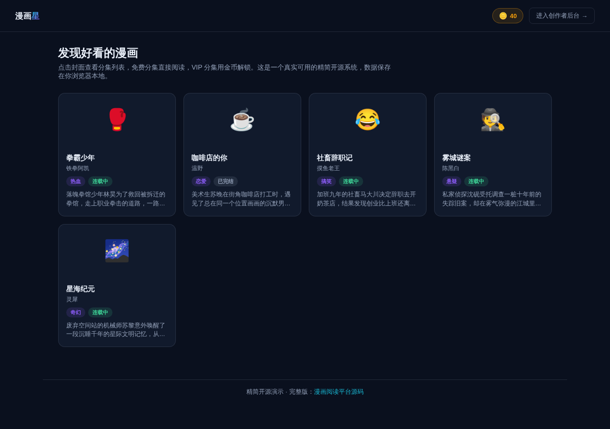

# 漫画阅读平台（精简开源版）· Comic-Lite

**[在线体验（前台）→](https://anna123123123-creator.github.io/comic-lite/)** · **[创作者后台 →](https://anna123123123-creator.github.io/comic-lite/admin.html)**

免费开源的漫画阅读平台精简版。这不是截图或原型图，是一个**真实可用**的前后台系统：漫画分类浏览、竖向分镜滚动阅读、VIP 分集金币解锁与余额校验，后台漫画/分集/分镜增删改查、真实的数据看板统计——都是真功能，纯前端 + `localStorage` 实现，不需要服务器、不需要数据库，克隆下来打开就能用，也适合作为学习或二次开发的起点。

> 说明：由于是纯前端 Demo、没有图片托管后端，阅读器里的每个"分镜"用 CSS 渐变色块 + 文字说明来模拟漫画分镜（而不是真实原画图片），但分集顺序、解锁状态、金币扣费等全部是真实数据逻辑，不是摆设。



## 功能

**前台（读者视角）**
- 漫画列表浏览：封面、标题、作者、分类、连载状态、简介
- 点开漫画查看分集列表：免费分集显示"阅读"，VIP 分集显示锁定图标和所需金币，已解锁的显示"已解锁"
- 竖向滚动分镜阅读器：按顺序展示该话所有分镜，底部可直接跳转上一话/下一话
- VIP 分集解锁确认：展示所需金币与当前余额，余额不足会拒绝解锁并给出明确的错误提示；解锁成功后扣除金币、生成解锁记录并立即进入阅读
- 顶部实时显示当前金币余额

**后台（创作者/运营视角）**
- 仪表盘：漫画总数、分集总数、VIP 分集总数、累计消耗金币（真实汇总所有解锁记录），以及最近解锁记录表
- 漫画管理：新增、编辑、删除漫画（删除会级联删除该漫画下的所有分集）
- 分集管理：按漫画筛选分集，新增/编辑/删除分集，内置分镜编辑器，可逐条添加、编辑、删除分镜文案

## 试用方法

克隆下来，直接用浏览器打开 `index.html`，或用静态文件服务器跑起来：

```bash
python3 -m http.server 8000
```

前台在 `index.html`，后台在 `admin.html`。所有数据存在浏览器的 `localStorage` 里（`comic_lite_data_v1` 这个 key），后台侧边栏有"重置示例数据"按钮可以随时清空重来。

## 技术说明

没有用任何框架或构建工具，纯原生 HTML/CSS/JavaScript，一共 5 个文件：`data.js`（数据层，负责 localStorage 读写和种子数据）、`index.html` + `script.js`（前台）、`admin.html` + `admin.js`（后台）、`style.css`（样式）。因为是纯前端 Demo，数据只存在当前浏览器本地、当前这一个"读者"身上，不同设备/浏览器之间不会同步，也没有真实的多用户账号体系——真实生产系统需要一个后端 API + 数据库来替换 `data.js` 里的存储层，加上真实的原画图片托管/CDN、账号体系和支付充值通道，界面和交互逻辑基本可以直接复用。

## 协议

MIT，随便怎么用都行。

## 需要定制版？

这个工具免费开源、可以直接用。如果你需要的是**改造成适合自己业务的版本**——换品牌、改字段、加功能、接后端或数据库——我可以做。

- **交付周期**：3–10 个工作日
- **交付内容**：完整源码（不加密、可自行二次开发）+ 在线地址 + 部署说明
- **已有 49 套现成系统**可直接改造，覆盖电商、教育、门店、内容、跨境等行业：[全部清单与在线演示](https://inzyxuashop.com)

把你的需求发给我，24 小时内回复可行性与报价：**evcdecd@gmail.com**
